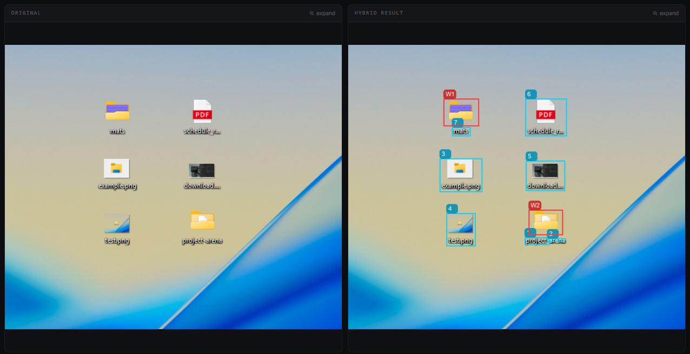
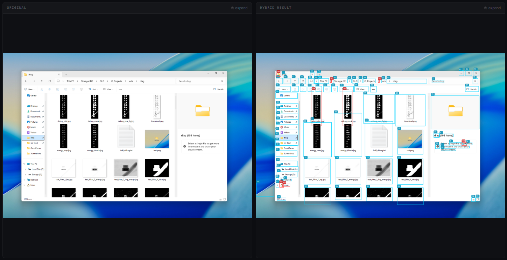
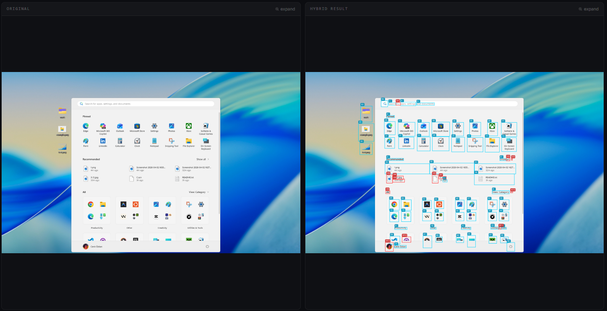
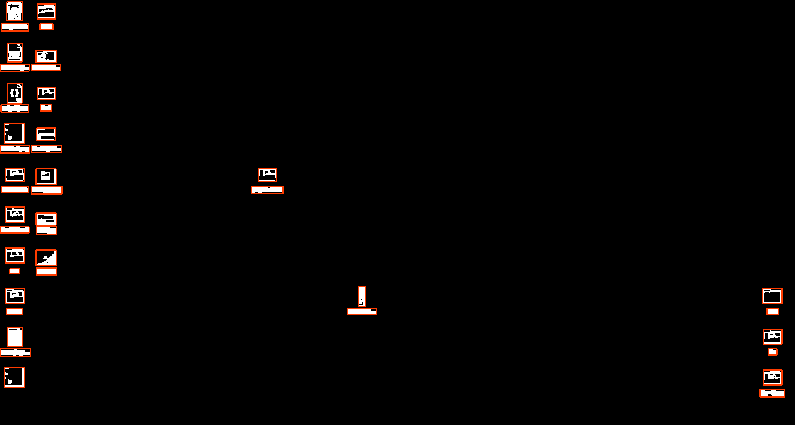

# Hybrid WDS — Enhanced Screen Parsing via Laplacian Structure Detection (LSD)

OmniParser is great, but it sometimes misses small icons or text on screen. **Hybrid WDS** fixes that by layering Laplacian Structure Detection on top of OmniParser's output to catch what it leaves behind.

> 🔵 Blue = OmniParser detections &nbsp;|&nbsp; 🔴 Red = Hybrid WDS additional detections

---

## Comparison

| WDS | WDS |
|---|---|
|  |  |





---

## Requirements

- [Node.js](https://nodejs.org/)
- [Python](https://python.org/)

---

## Getting Started

**1. Install JS dependencies**
```bash
npm install
```

**2. Download the AI models**

The models are too large to include in the repo, so you'll need to grab them separately:
```bash
cd OmniParser
pip install -r requirements.txt
python download_models.py
```

**3. Run the app**
```bash
npm run tauri dev
```

---

## How It Works

Hybrid WDS runs OmniParser as usual, then passes the result through a Laplacian Structure Detection layer that scans for edges and regions the first pass missed — particularly small icons, fine text, and low-contrast UI elements. The two sets of detections are merged and deduplicated into a single output.

---

## License

MIT
